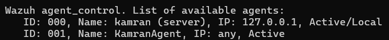
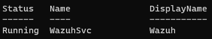
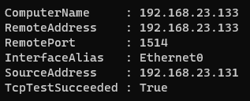
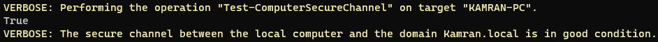
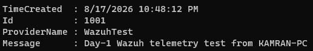
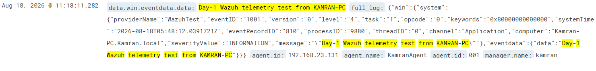
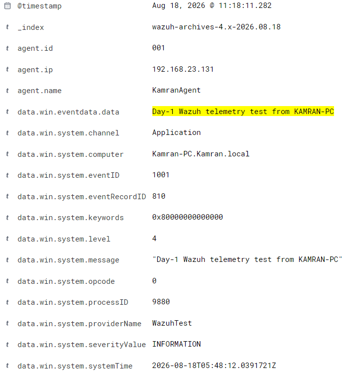
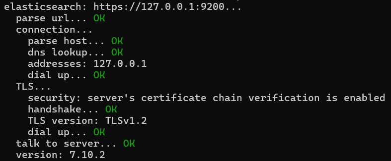

# Wazuh Windows Endpoint Integration

## Objective

Integrate a Windows endpoint with Wazuh and verify that Windows telemetry is successfully collected by the Wazuh Agent and received by the Wazuh Manager.

## Lab Environment

| Component | Details |
|---|---|
| Windows Endpoint | KAMRAN-PC |
| Windows IP | 192.168.23.131 |
| Domain | Kamran.local |
| Domain Controller | 192.168.23.128 |
| Wazuh Manager | 192.168.23.133 |
| Wazuh Agent | KamranAgent |
| Agent ID | 001 |

## Work Completed

- Verified Wazuh Agent status.
- Verified Windows Wazuh service.
- Tested connectivity between the Windows endpoint and Wazuh Manager.
- Verified the domain secure channel.
- Verified Wazuh Agent logs.
- Generated a controlled Windows event.
- Verified the event in Wazuh archives.
- Verified the event in Wazuh Discover.
- Verified Filebeat output connectivity.

## Evidence

### 1. Wazuh Agent Status

### 2. Windows Wazuh Service

### 3. Agent Manager Connectivity

### 4. Domain Secure Channel

### 5. Wazuh Agent Log

(./
)

### 6. Test Event Created

### 7. Wazuh Archive Event

### 8. Wazuh Discover Event

### 9. Filebeat Output

## Result

The Windows endpoint was successfully integrated with the Wazuh environment.

The lab verified the endpoint's Wazuh service, network connectivity, domain secure channel, agent logging, Windows event generation, Wazuh archive ingestion, Wazuh Discover visibility, and Filebeat output connectivity.
